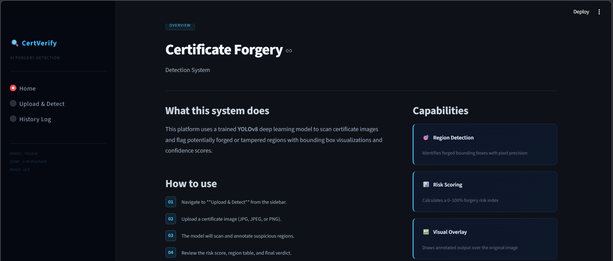
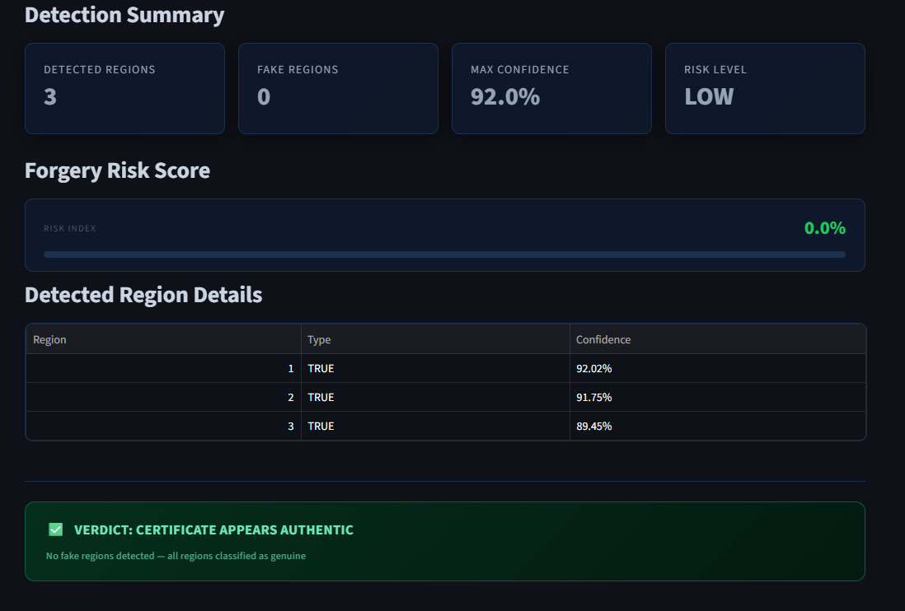
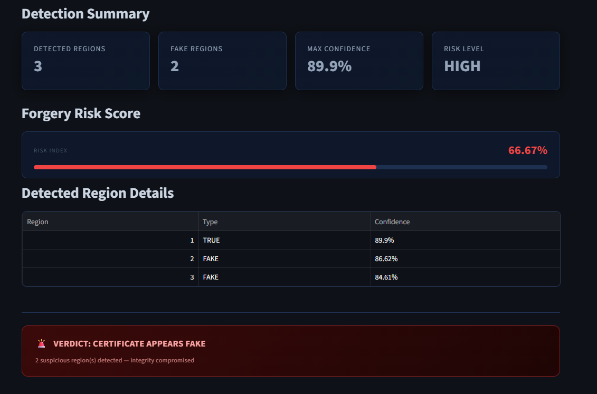
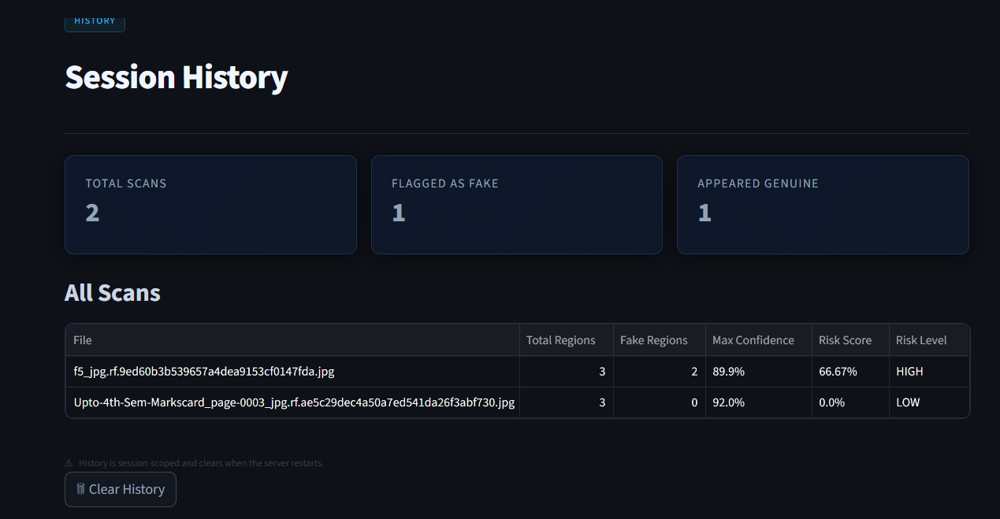

# Certificate Forgery Detection System using YOLOv8 and Deep Learning

## Overview
The **Certificate Forgery Detection System** is a deep learning-based application designed to automatically detect tampering in digital certificate images.  

The system uses **YOLOv8 object detection**, **Convolutional Neural Networks (CNN)**, and **image forensic techniques such as Error Level Analysis (ELA)** to identify suspicious modifications in certificates.

This solution helps institutions, recruiters, and organizations verify certificate authenticity while reducing manual verification effort and minimizing fraud.

---

## Key Features

- Automatic **Certificate Tampering Detection**
- **YOLOv8 Object Detection** for identifying certificate components
- **CNN-based Forgery Classification**
- **Error Level Analysis (ELA)** for compression inconsistency detection
- Detection of manipulated regions such as:
  - Fake signatures
  - Modified stamps
  - Altered text
  - Copy–move forgery
- **Forgery Risk Score (0–100%)**
- **Bounding box visualization** of suspicious regions
- **Streamlit Web Application Interface**
- **Session history logging**

---

## System Architecture

The system follows a **two-stage deep learning pipeline**.

### Stage 1: Structural Verification
YOLOv8 detects important certificate components including:

- Logos
- Signatures
- Stamps
- Text fields

This stage identifies structural inconsistencies such as missing or misplaced elements.

### Stage 2: Forgery Detection
Detected regions are analyzed using forensic techniques:

- Convolutional Neural Networks (CNN)
- Error Level Analysis (ELA)
- Noise pattern detection
- Pixel anomaly detection
- Texture inconsistency analysis

Finally, the system classifies the certificate as:

- **Authentic**
- **Tampered**

---

## Technologies Used

| Technology | Purpose |
|-----------|--------|
| Python | Programming Language |
| YOLOv8 | Object Detection |
| CNN | Image Classification |
| OpenCV | Image Processing |
| Streamlit | Web Interface |
| NumPy | Numerical Computation |
| Pandas | Data Analysis |
| Matplotlib | Visualization |

---
## Screenshots

### Home Page


### Upload Certificate 


### Detection Summary


### Detection Summary and Risk Score


### History Session Page


---

## Installation

### Clone the Repository

```bash
git clone(https://github.com/hariragavan005/Certificate-tempering-Detection-Using-Error-Level-Analysis-and-CNN)

cd certificate-forgery-detection

pip install -r requirements.txt

streamlit run main_app.py

http://localhost:8501
```
## Author: Hari Haran G
